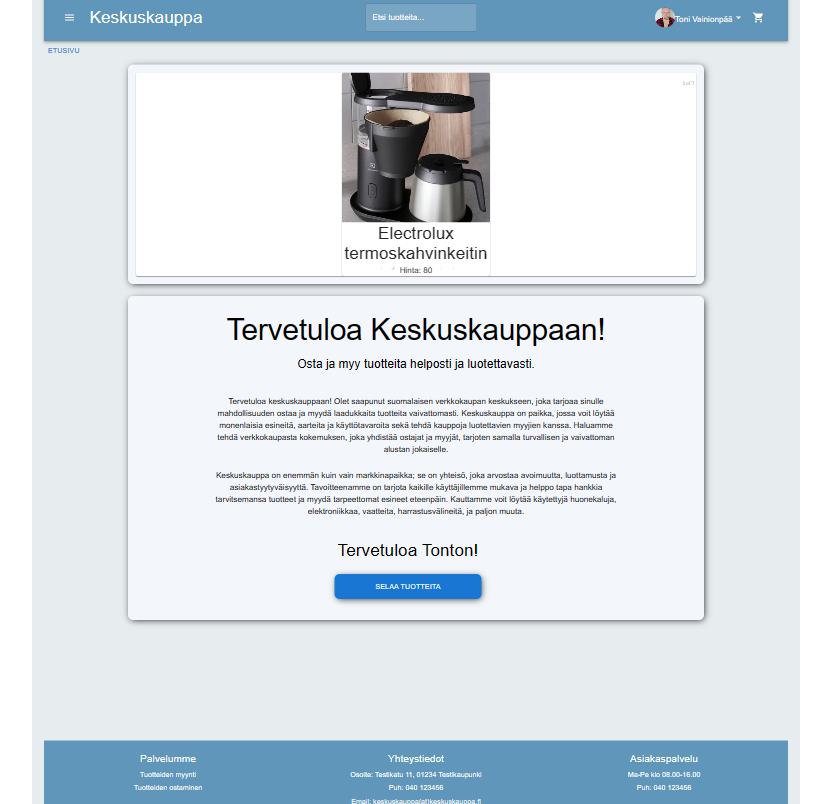
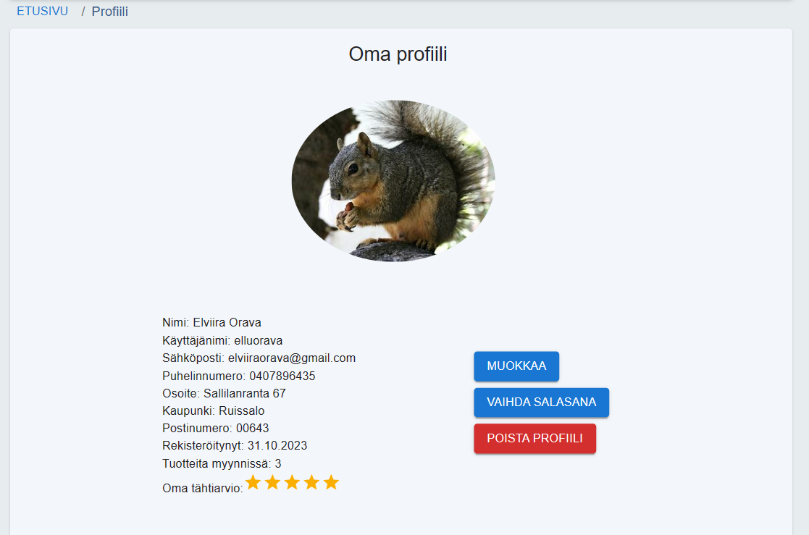

# Keskuskauppa: A safer user-to-user marketplace

  
   
    
   
   
  

## Project description

Tired of the uncertainty of secondhand online shopping? The Finnish market offers many platforms to buy and sell secondhand items user to user, but none of them guarantees a particularly safe user experience. Inspired by this, we set out to create an online secondhand marketplace with added security.

To do this, we lent ideas from the international market of second hand selling and designed a system that works for the Finnish market and locality. 

### Features in a nutshell

The most important feature is buyer's security in making a purchase. Once a purchase is made, instead of wiring the money to the seller with no guarantee of ever receiving the product, the service holds on to the payment until the buyer has confirmed that the product has been received. If no product is received, the system returns the money to the buyer. The security of the seller is also guaranteed, as they won't be asked to send anything before the buyer has made the payment.

Another feature that reinforces a secure buying experience a seller review system.

### Features in detail

Secure market place: Only registered users can make purchases, sell items and take part in user-to-user messaging.

Secure buying experience: The service holds on to your money while you wait to receive your purchase. The seller confirms the shipment by logging the related tracking code on the website. When the buyer has received the product, they manually confirm it. Only then is the money wired to the seller. 

In the case that the seller has successfully sent the product with tracking information that can be found on the deliverer's website and it can be seen that the parcel has been delivered but the buyer claims not to have received the parcel, after a reasonable time the noney will be wired to the seller in any case.

Seller review system: Leave an honest review of your experience with a particular seller. Includes a star review as well as a written comment. Read reviews others have given to get a better idea of how trustworthy a seller has been found to be by others. The seller also has the chance to tell their side of the story by commenting the review.

View products by category: Browse items by category and subcategory. This feature is also available for non-registered users.

Search: search directly for items any time from the always visible navbar. Search results are given in a handy and quick dropdown for the most recently added hits, and a full search results page delivers all the results.

Order history: See your purchases and sales from your personal order history page. Check details, confirm sending and receiving of a product and leave reviews.

## Plans for future development

- User-to-user messaging: Contact the seller before making a purchase to ask questions and discuss.
- Multipicture uploading
- Product pictures: zooming in
- A range of search filter options
- Admin's side to oversee the operating of the website

## Key Tech Insights

This undertaking was built as a fullstack project as part of a fullstack web development course.

- Powered by: TypeScript, Node.js, React, Express.js, PSQL and Docker
- Cloud: Azure-backed for a reliable experience [Keskuskauppa on Azure](https://keskuskauppa-app.azurewebsites.net/)
- Quality Matters: Rigorous testing with Jest, and linted to excellence with ESLint.

### Database structure

### UI plan

## How to install and run

Here's how to get the program running.

1. In terminal, navigate to the directory where you cloned the project and run command `npm install`. 
2. Build a docker image with command `npm run docker:build`
3. Run the docker image with command `npm run docker:start`. This uses local settings for the application in `.env` file. `.env` file **must be** in backend directory only and does not come with the repository. Here are the basic details of what the file should include:

PORT= The port you are using on localhost  
PG_HOST= The IP address of your database  
PG_PORT= Local database port  
PG_USERNAME= Admin username  
PG_PASSWORD= Admin password  
PG_DATABASE= The name of your database  
SECRET= A secret word defined by you  

4. Next, run command `npm run dev`. This runs both frontend and backend in development mode and watches for any changes in files in ./src directories.

## Dev team

**Maaret Lyytinen**  
@: maaret.lyytinen@gmail.com  
gitlab: https://gitlab.com/maarly  
LinkedIn: https://www.linkedin.com/in/maaretlyytinen/  

**Toni Vainionpää**  
@: neworen(at)gmail.com  
gitlab: https://gitlab.com/Toni86-pang  
LinkedIn:  https://www.linkedin.com/in/toni-vainionpaa/  

**Salla Kaikkonen**  
@: salla.maria2@gmail.com   
gitlab: https://gitlab.com/SallaK-97  
linkedin: https://www.linkedin.com/in/salla-kaikkonen/  

**Sami Nissinen**  
@: snissine@gmail.com  
gitlab: https://gitlab.com/ni5u 
linkedin: https://www.linkedin.com/in/sami-nissinen/  

**Joonas Huhdanmäki**  
@jhuhdanmaki@gmail.com  
github: https://github.com/jopinihu  
linkedin: www.linkedin.com/in/joonas-huhdanmäki  

**Paula Häyrynen**  
@: paula.hayrynen@hotmail.fi  
gitlab: https://gitlab.com/Paukku1  
linkedin: https://www.linkedin.com/in/paula-häyrynen   
